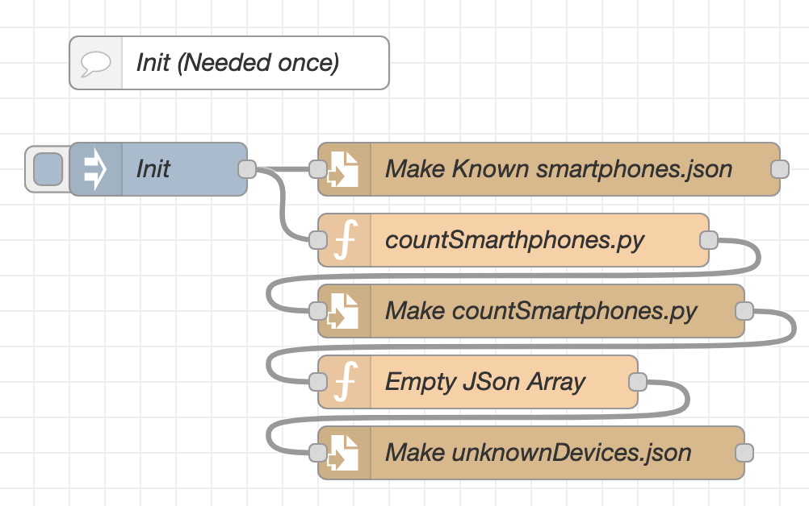

# Deployment
The deployment is rather time consuming and requires a lot of manual steps. I will try to describe the steps as good as possible.

## Prerequisites
- Host computer that will run: `node-red`, `MQTT Broker` and `influxdb` (optional).
- One or more ESP32 (any microcontroller with BLE support should work, but may require to install different libraries).
- Local network and WIFI
## Setup the Host Computer
### 1. Install MQTT 
Install MQTT Broker (e.g. [Mosquitto](https://mosquitto.org/)).
Since the installation process might differ from version to version and by OS-System a step-by-step guide on how to install Mosquitto is not provided. [This guide](https://randomnerdtutorials.com/how-to-install-mosquitto-broker-on-raspberry-pi/) should be a good starting point and should be hopefully kept updated.
   - Be sure to remeber the IP address of the MQTT Broker, User and Password as they will be required later.
   - This guide assumes that **no certificate** for MQTT is used, but could be easily setup with some changes in the python code and Node-red at a later point.

The mosquitto.conf file could look like this:
   ``` bash
   # listen tcp
   listener 1883
   # listen websockets
   listener 9001
   listener 8001
   protocol websockets
   socket_domain ipv4
   # allow no auth
   allow_anonymous true
   ```
### 2.  Install [InfluxDB](https://docs.influxdata.com/influxdb/v2.7/get-started/) (Optional)
Please follow the offical [installation guide](https://docs.influxdata.com/influxdb/v2.7/get-started/) to install InfluxDB. This step is optional as InfluxDB is only used to persist and visualize the data.
  - Make an empty bucket named `PEOPLE_COUNTER`
  - Generate an **API token** with read and write access to the bucket.
### 3. Install [NodeRed](https://nodered.org/)
Follow the [offical guide](https://nodered.org/#get-started) to install NodeRed. On linux is should be as simple as running this command:
```bash
sudo apt-get install nodered
```
**Install required Modules** (can be installed from `Manage Palette` -> `Install`):
- node-red-contrib-data-table-viewer
- node-red-contrib-influxdb

**Import the `nodeRed.json` file**:
1. Open NodeRed in a browser (e.g. http://localhost:1880).
2. Click on the menu in the top right corner.
3. Click on `Import` -> `Clipboard`.
4. Paste the content of the `Interface/nodeRed.json` file.

**Configure**
1. Run the Init Node to create the required files (it creates some required files, check Smartphone Counter directory).

2. Configure the `Trigger Scan` Node MQTT Server.  
3. Configure the `roomUtilization/scans/+` Node MQTT Server.  
4. Configure the `Send to DB` Node.
 
## Setup ESP32
### 1. Install esptool (needed to flash the board with microPython)   
Run this command:
``` bash
pip install esptool
```
Refer to the [official documentation](https://docs.espressif.com/projects/esptool/en/latest/esp32/) for more information.

### 2. Flash the board with microPython
1. Find out the port of the board:  
Depending on the OS, the port can be different. For example, on Linux it can be ```/dev/ttyUSB0``` or ```/dev/ttyACM0```. On Mac it can be ```/dev/tty.SLAB_USBtoUART```. On Windows it can be ```COM1```. To find out the port, you can use the following command:

``` bash
ls /dev/tty* 
ls /dev/cu*
```  

2. Download the latest microPython firmware from [here](https://micropython.org/download/). If using the ESP32 [here](https://micropython.org/download/esp32/).

3. Flash the board with the following commands (replace the port with the one you found out in step 1 and the firmware):

``` bash
esptool.py --chip esp32 --port [PORT] erase_flash
esptool.py --chip esp32 --port [PORT] --baud 460800 write_flash -z 0x1000 [FIRMWARE.bin]
```

or try this if the above does not work:

``` bash
esptool.py --port /dev/tty.usbserial-0001 --baud 460800 write_flash --flash_size=detect 0 [FIRMWARE.bin]
```

Refer to the [official documentation](https://docs.micropython.org/en/latest/esp8266/tutorial/intro.html#deploying-the-firmware) for more information.

### 3. Configure the project
Make sure to change the `SSID` (WI-FI Name), `NETWORK_KEY` (WI-FI Password) and `MQTT_BROKER_ADDRESS` (IP) constants in the `BLE Scanner/config.py` file.

### 4. Upload the project to the board
Depending on preferences Visual Studio Code or Thonny can be used to develop and upload the project to the board. If you fancy you could also use the comand line and vim ;)

#### Setup the project using Visual Studio Code
1. Install the [Pymakr extension](https://marketplace.visualstudio.com/items?itemName=pycom.Pymakr) for Visual Studio Code.
2. Open the `BLE Scanner` folder in Visual Studio Code. **Not the entire git repo!**
3. Setup your board as device in Pymakr (it might help to stop the script if you get the warning "board is busy").
4. Upload the project to the board using the upload button in Pymakr.
5. Open the serial monitor in Pymakr to see the output of the board.
6. **Done!**
#### Setup the project using Thonny
1. Install [Thonny](https://thonny.org/).
2. Open the project in Thonny.
3. Select the correct board and port in the bottom right corner.
4. Upload the project to the board using the upload button in Thonny.
5. Open the serial monitor in Thonny to see the output of the board.
6. **Done!**

The project should be deployed and running!
By default the NodeRed Flow should trigger a scan of the room every 30s. A scan can also be triggered manually with the `Scan myRoom` node.
## Working with the project and throubleshooting
### Get code completion for the project (Option 1)
The 'lib' folder is already added to the project. This folder contains the libraries needed for the project (the ones that are specific to the esp32). If you want to add more libraries, add them to the 'lib' folder. To do so, you can use the following command:   
(Note) for this to work, the board needs to be connected to the internet.
1. Connect to the board using the serial monitor in Pymakr.
```bash
import mip
mip.install("myLib", mpy=False)
```
1. Copy the sources from the esp to your local machine using PyMakr or another tool (for example esptool).

Official Documentation can be found [here](https://docs.micropython.org/en/latest/reference/packages.html).

### Get code completion for the project by stubbing (Option 2)
1. run `import sys; print( "version:", sys.version, "port:", sys.platform)` to get the port and micropython version
2. `python3 -m venv .venv` `source .venv/bin/activate` 
3. Get the stub with the same version and port [here](https://github.com/Josverl/micropython-stubs/tree/main/stubs) or generate one [here](https://github.com/Josverl/micropython-stubber#readme) if it doesn't exist.
4. Now run `pip install -U  micropython-<port>-stubs` in the virtual environment. For example: `pip install -U micropython-esp32-stubs`

### Get code completion for the project by stubbing yourself (Option 3) (Good luck)
[Using](https://github.com/Josverl/micropython-stubber#readme) (the install guide on Github does not work)...
1. Create a virtual environment:
```bash 
python3 -m venv .venv
``` 
2. Activate the virtual environment:
```bash
source .venv/bin/activate
```
3. Install the stubber: 
```bash
pip install micropython-stubber
```
4. Run the stubber:
``` bash
mkdir all-stubs && mkdir stubs
```
5. No clue why or what this does:
``` bash
touch pyproject.toml 
```
``` bash
stubber clone
```
``` bash
stubber switch v1.18
```
``` bash
stubber get-docstubs
```
``` bash
stubber get-frozen  
```
``` bash
stubber get-core
```
``` bash
stubber update-fallback
```
6. Include extraPaths in .vscode/settings.json for the stubs to be found by the IDE. For example: `"python.autoComplete.extraPaths": ["./stubs"]`
