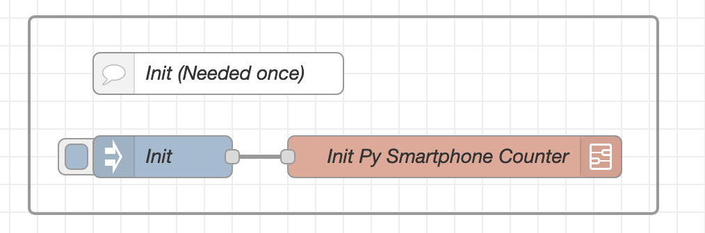

# Deployment
The deployment is rather time consuming and requires a lot of manual steps. I will try to describe the steps as good as possible.

Table of Contents
=================

- [Deployment](#deployment)
- [Table of Contents](#table-of-contents)
- [0. Prerequisites](#0-prerequisites)
  - [0.1 Ports](#01-ports)
- [1. Install Dependencies](#1-install-dependencies)
  - [1.0 Docker](#10-docker)
  - [1.1 Portainer (Optional)](#11-portainer-optional)
  - [1.2 Get the project](#12-get-the-project)
  - [1.3 Mosquitto Stack](#13-mosquitto-stack)
  - [1.4 InfluxDB Stack](#14-influxdb-stack)
  - [1.5 Node-Red Stack](#15-node-red-stack)
- [2. Setup Node-Red](#2-setup-node-red)
  - [2.a Install required Modules](#2a-install-required-modules)
  - [2.b Import the flow:](#2b-import-the-flow)
  - [2.c Configure the flow](#2c-configure-the-flow)
  - [2.d Test the setup](#2d-test-the-setup)
- [Setup ESP32](#setup-esp32)
  - [1. Install esptool](#1-install-esptool)
  - [2. Flash the board with microPython](#2-flash-the-board-with-micropython)
  - [3. Configure the project](#3-configure-the-project)
  - [4. Upload the project to the board](#4-upload-the-project-to-the-board)
- [Working with the project and throubleshooting](#working-with-the-project-and-throubleshooting)
  - [(Option 1) Get code completion for the project](#option-1-get-code-completion-for-the-project)
  - [(Option 2) Get code completion for the project by stubbing](#option-2-get-code-completion-for-the-project-by-stubbing)
  - [(Option 3) (Good luck) Get code completion for the project by stubbing yourself](#option-3-good-luck-get-code-completion-for-the-project-by-stubbing-yourself)


# 0. Prerequisites
- Host computer that will run: `node-red`, `MQTT Broker`, and `InfluxDB` (optional).
- One or more ESP32 (any microcontroller with BLE support should work, but may require installing different libraries).
- Local network and WIFI

## 0.1 Ports
The following ports are used by the services and may need to be opened in your firewall:

- HTTP and HTTPS: 80, 443
- Portainer: 9443 (Required only if running on a remote machine on another network)
- Mosquitto: 1883 (Used by Microcontroller and Node-Red)
- Node-Red: 1880 (Required only if running on a remote machine on another network)
- InfluxDB: 8086 (Used only by Node-Red and yourself)

```bash
# HTTP
iptables -A OUTPUT -p tcp --dport 80 -j ACCEPT
iptables -A INPUT -p tcp --dport 80 -j ACCEPT
# HTTPS
iptables -A OUTPUT -p tcp --dport 443 -j ACCEPT
iptables -A INPUT -p tcp --dport 443 -j ACCEPT
# Portainer
iptables -A INPUT -p tcp --dport 9443 -j ACCEPT
# Mosquitto
iptables -A INPUT -p tcp --dport 1883 -j ACCEPT
# Node-Red
iptables -A INPUT -p tcp --dport 1880 -j ACCEPT
# InfluxDB
iptables -A INPUT -p tcp --dport 8086 -j ACCEPT
```

# 1. Install Dependencies
We need 3 services to run the project:
- [X] Mosquitto
- [X] InfluxDB
- [X] Node-Red
- [X] Docker (Optional)
- [X] Portainer (Optional)

In my opinion, the best way to run these services is using Docker but, of course, you can install them on your local machine without Docker. Installing them manually might require some changes in the NodeRed flow and the MicroPython code (for example, if you do not configure MQTT to use a username and password, you will need to remove the username and password from the MicroPython code). Skip to the next section if you want to install them manually.
On a side note NodeRed can create a lot of log entries in journalctl. It is advised to run the following command to limit the log entries:
```bash
sudo journalctl --vacuum-size=100M
```

## 1.0 Docker
Check the official guide to install Docker depending on your OS.
[Official Docker Installation Guide](https://docs.docker.com/engine/install/debian/)

## 1.1 Portainer (Optional)
Portainer is a web-based user interface for managing Docker containers. It is not required but is a nice tool to manage your Docker containers.
[Portainer Installation Guide](https://docs.portainer.io/start/install-ce/server/docker/linux).

Portainer's user interface should be available at: https://localhost:9443

## 1.2 Get the project
Clone the project from the GitLab repository:
```bash
git clone https://gitlab.rz.htw-berlin.de/s0567011/ble-room-occupancy-detection
```
In alternative if you don't have git installed or want to mess with authentication you can download the project as a zip file and transfer it to your server using scp or any other method.
```bash
 scp -r /path/to/ble-room-occupancy-detection xxxx@xxxxxx:/path/to/ble-room-occupancy-detection
```

## 1.3 Mosquitto Stack
Change to the Mosquitto deployment directory:
```bash
cd Deployment/mosquitto
```
Start the Mosquitto service (detached):
```bash
docker compose up -d
```
Configure the Mosquitto username and password:
```bash
docker compose exec mosquitto mosquitto_passwd -b -c mosquitto/config/mosquitto.passwd USER PASSWORD
```
Change the permissions of the `mosquitto.passwd` file:
```bash
docker compose exec mosquitto chmod 0700 /mosquitto/config/mosquitto.passwd
```
Restart the Mosquitto service to apply the changes:
```bash
docker compose restart
```

## 1.4 InfluxDB Stack
This is kind of optional if no data should be stored. The Node-Red flow can be configured to store the data in a different database.

Change to the InfluxDB deployment directory:
```bash
cd Deployment/influxdb
```
Start the InfluxDB service (detached):
```bash
docker compose up -d
```
The service should be available at: http://localhost:8086
Access the web interface in your browser and follow the setup guide. NodeRed is configured to use `HTW` as organization, but can be manually changed if prefered. Be sure to write down the organization and the token (a new token can also be created later). Note when you copy the token in my experience the **copy to clipboard** button does not work correctly (copy&past manually). Go to Buckets and create a new one called `BLE_SCANS`.

## 1.5 Node-Red Stack
Change to the Node-Red deployment directory:
```bash
cd Deployment/nodered
```
Start the Node-Red service (detached):
```bash
docker compose up -d
```
The container is started with a default user and password:
- User: `admin`
- Password: `projectIotWiSe23`

### 1.5b Change Node-Red Panel password:
Get container shell:
```bash
docker exec -it nodered /bin/bash
```
Create a password hash:
```bash
node-red admin hash-pw
```
Update the password hash in the `settings.js` file:
```bash
adminAuth: {
    type: "credentials",
    users: [{
        username: "admin",
        password: "YOUR_PASSWORD_HASH",
        permissions: "*"
    }]
},
```
Restart the container:
```bash
docker restart nodered
```

# 2. Setup Node-Red
Continue here if you have installed Node-Red manually or using Docker.

## 2.a Install required Modules
### (Option 1): Using docker container shell
Get container shell (**SKIP IF YOU ALREADY HAVE SHELL**):
```bash
docker exec -it nodered /bin/bash
```
Login to Node-Red:
```bash
node-red admin login
```
Install the modules:
```bash
node-red admin install node-red-dashboard
node-red admin install node-red-contrib-influxdb
node-red admin install node-red-node-ui-table
```
### (Option 2): Using the Node-Red UI
Open the Node-Red UI in a browser (e.g., http://localhost:1880).

`Manage Palette` -> `Install`:
- node-red-dashboard
- node-red-contrib-influxdb
- node-red-node-ui-table

## 2.b Import the flow:
1. Open NodeRed in a browser (e.g. http://localhost:1880).
2. Click on the menu in the top right corner.
3. Click on `Import` -> `Clipboard`.
4. Paste the content of the `Interface/nodeRed.json` file.

## 2.c Configure the flow
1. Run the Init Node to create the required files (it creates some required files, check Smartphone Counter directory).

2. Configure the `Trigger Scan` Node MQTT Server.
3. Configure the `Send to DB` Node.
 
## 2.d Test the setup
To test the setup you can use the `Testing/Debugging Block` at the bottom of the flow. Just click on the mock input a few times and check the output in the debug tab.

# Setup ESP32
## 1. Install esptool
Esptool is a tool to communicate with the ROM bootloader in Espressif microcontrollers. It is used to flash the board with microPython.

Run this command on the machine connected to the board:
```bash
pip install esptool
```
Refer to the [official documentation](https://docs.espressif.com/projects/esptool/en/latest/esp32/) for more information.

## 2. Flash the board with microPython
1. Find out the port of the board:  
Depending on the OS, the port can be different. For example, on Linux it can be ```/dev/ttyUSB0``` or ```/dev/ttyACM0```. On Mac it can be ```/dev/tty.SLAB_USBtoUART```. On Windows it can be ```COM1```. To find out the port, you can use the following command:

```bash
ls /dev/tty* 
ls /dev/cu*
```  

2. Download the latest microPython firmware from [here](https://micropython.org/download/). If using the ESP32 [here](https://micropython.org/download/esp32/).

3. Flash the board with the following commands (replace the port with the one you found out in step 1 and the firmware):

```bash
esptool.py --chip esp32 --port [PORT] erase_flash
esptool.py --chip esp32 --port [PORT] --baud 460800 write_flash -z 0x1000 [FIRMWARE.bin]
```

or try this if the above does not work:

```bash
esptool.py --port /dev/tty.usbserial-0001 --baud 460800 write_flash --flash_size=detect 0 [FIRMWARE.bin]
```

Refer to the [official documentation](https://docs.micropython.org/en/latest/esp8266/tutorial/intro.html#deploying-the-firmware) for more information.

## 3. Configure the project
Open the `BLE Scanner` folder in your favorite editor and open the `config.json` file. Set the `SSID` and `NETWORK_KEY` to your local network's SSID and password. Set the `MQTT_BROKER_ADDRESS` to the IP of the machine running the MQTT broker (do not include the port, the default port 1883 will be used). Set the `MQTT_USER` and `MQTT_PASS` to the username and password you set up for the MQTT broker. Set the `MQTT_ROOM_NAME` to the name of the room the board will be placed in. A full list of all the options can be found [here](README.md).

## 4. Upload the project to the board
Depending on preferences Visual Studio Code or Thonny can be used to develop and upload the project to the board. If you fancy you could also use the comand line and vim ;)

### 4.a (Option 1) Setup the project using Visual Studio Code
1. Install the [Pymakr extension](https://marketplace.visualstudio.com/items?itemName=pycom.Pymakr) for Visual Studio Code.
2. Open the `BLE Scanner` folder in Visual Studio Code. **Not the entire git repo!**
3. Setup your board as device in Pymakr (it might help to stop the script if you get the warning "board is busy").
4. Upload the project to the board using the upload button in Pymakr.
5. Open the serial monitor in Pymakr to see the output of the board.
6. **Done!**
### 4.b (Option 2) Setup the project using Thonny
1. Install [Thonny](https://thonny.org/).
2. Open the project in Thonny.
3. Select the correct board and port in the bottom right corner.
4. Upload the project to the board using the upload button in Thonny.
5. Open the serial monitor in Thonny to see the output of the board.
6. **Done!**

The project should be deployed and running!
By default the NodeRed Flow should trigger a scan of the room every 30s. A scan can also be triggered manually with the `Scan myRoom` node.

# Working with the project and throubleshooting
## (Option 1) Get code completion for the project 
The 'lib' folder is already added to the project. This folder contains the libraries needed for the project (the ones that are specific to the esp32). If you want to add more libraries, add them to the 'lib' folder. To do so, you can use the following command:   
(Note) for this to work, the board needs to be connected to the network.
1. Connect to the board using the serial monitor in Pymakr.
```bash
import mip
mip.install("myLib", mpy=False)
```
1. Copy the sources from the esp to your local machine using PyMakr or another tool (for example esptool).

Official Documentation can be found [here](https://docs.micropython.org/en/latest/reference/packages.html).

## (Option 2) Get code completion for the project by stubbing 
1. run `import sys; print( "version:", sys.version, "port:", sys.platform)` to get the port and micropython version
2. `python3 -m venv .venv` `source .venv/bin/activate` 
3. Get the stub with the same version and port [here](https://github.com/Josverl/micropython-stubs/tree/main/stubs) or generate one [here](https://github.com/Josverl/micropython-stubber#readme) if it doesn't exist.
4. Now run `pip install -U  micropython-<port>-stubs` in the virtual environment. For example: `pip install -U micropython-esp32-stubs`

## (Option 3) (Good luck) Get code completion for the project by stubbing yourself 
[Using](https://github.com/Josverl/micropython-stubber#readme) (the install guide on Github does not work)...
1. Create a virtual environment:
```bash 
python3 -m venv .venv
``` 
2. Activate the virtual environment:
```bash
source .venv/bin/activate
```
3. Install the stubber: 
```bash
pip install micropython-stubber
```
4. Run the stubber:
``` bash
mkdir all-stubs && mkdir stubs
```
5. No clue why or what this does:
``` bash
touch pyproject.toml 
```
``` bash
stubber clone
```
``` bash
stubber switch v1.18
```
``` bash
stubber get-docstubs
```
``` bash
stubber get-frozen  
```
``` bash
stubber get-core
```
``` bash
stubber update-fallback
```
6. Include extraPaths in .vscode/settings.json for the stubs to be found by the IDE. For example: `"python.autoComplete.extraPaths": ["./stubs"]`

CONGRATULATIONS! 
You have now successfully stubbed the micropython libraries. You can now use the stubs to get code completion in your IDE. #WorthIt?