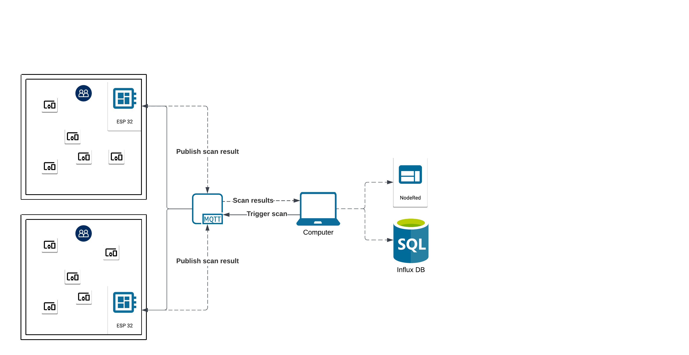
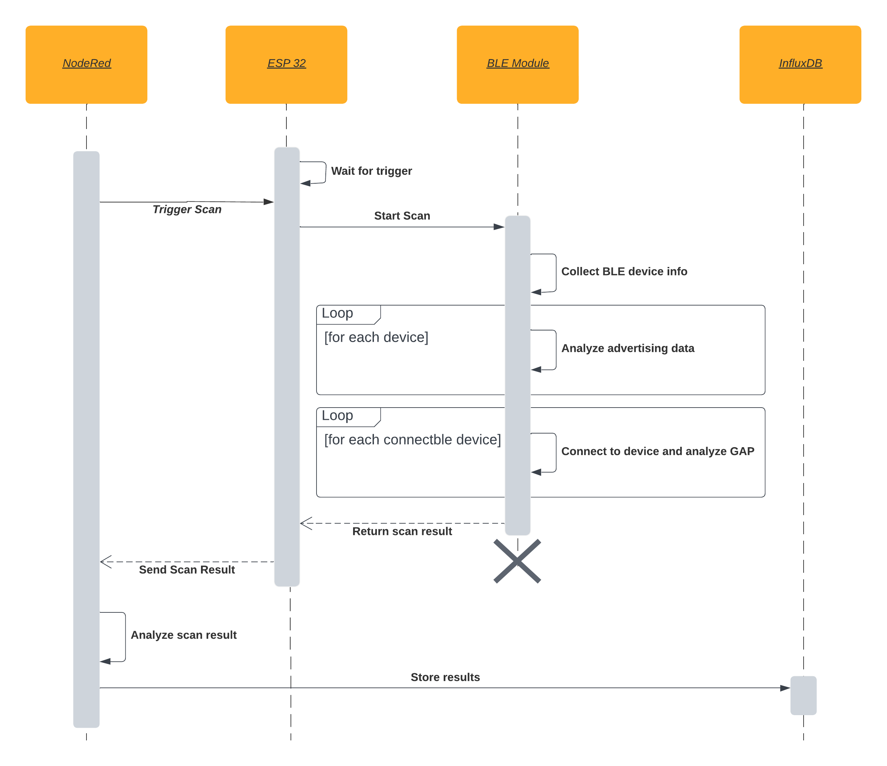

# BLE (Bluetooth Low Energy) Room occupancy detection
This section provides an introduction to the project, while the deployment process is detailed in the [Deployment](./Deployment.md) document.

Table of Contents
=================
- [BLE (Bluetooth Low Energy) Room occupancy detection](#ble-bluetooth-low-energy-room-occupancy-detection)
- [Table of Contents](#table-of-contents)
- [Introduction](#introduction)
  - [Motivation](#motivation)
- [Improving Herbrich's Approach](#improving-herbrichs-approach)
  - [Current Approach](#current-approach)
  - [Improving the Accuracy of Occupancy Detection](#improving-the-accuracy-of-occupancy-detection)
    - [Analyzing Advertising Data](#analyzing-advertising-data)
    - [Connecting to the Device and Reading the Device Info Service](#connecting-to-the-device-and-reading-the-device-info-service)
    - [Multiple BLE Scanners](#multiple-ble-scanners)
- [Implementation](#implementation)
  - [The System Architecture](#the-system-architecture)
- [Future Work](#future-work)
  - [In-Depth Analysis of Smartphone Characteristics](#in-depth-analysis-of-smartphone-characteristics)
  - [Comprehensive Examination of Advertising Data](#comprehensive-examination-of-advertising-data)
  - [Distinguishing Moving and Stationary Devices](#distinguishing-moving-and-stationary-devices)
  - [Address Hashing for Enhanced Privacy](#address-hashing-for-enhanced-privacy)
  - [Streamlined Deployment with Docker](#streamlined-deployment-with-docker)
  - [Classifier-Based Smartphone Identification](#classifier-based-smartphone-identification)
  - [Integration with Home Assistant](#integration-with-home-assistant)


# Introduction

This project is based on the work of Justin Steven Herbrich, whose project can be accessed with the following [link](https://github.com/jutnhbr/dln-ble-scanner-for-room-utilization). Herbrich introduced an approach that capitalizes on the ubiquity of BLE-capable devices. The core concept is to utilize BLE technology to detect nearby devices to estimate the occupancy of a room. The primary objective of this project is to enhance and refine Herbrich's approach, making it more accurate and scalable.

Herbrich's approach uses BLE technology to estimate the occupancy of a room. This approach is particularly relevant due to the widespread use of BLE-capable devices, which range from smartphones and tablets to laptops and other devices. By using BLE, Herbrich's project aims to provide an accurate and flexible solution to estimate the occupancy of a room.

However, while Herbrich's work showcases promise, it also leaves room for improvement, particularly in the realms of accuracy and scalability. This project aims to enhance the precision of occupancy estimates and expand the system's scalability. It does so by facilitating the simultaneous monitoring of multiple rooms and by extending the range of detectable devices within a single room.

## Motivation

The motivation behind this project is rooted in the critical need for accurate and scalable room occupancy detection systems. The significance of such systems has been magnified by recent global events that necessitate stricter adherence to social distancing and capacity limitations within indoor spaces.

Traditional methods for estimating room occupancy, such as physical headcounts or camera-based systems, have limitations. They often require manual intervention, which can be time-consuming, labor-intensive, and susceptible to human error. Additionally, camera-based systems raise privacy concerns and may not be viable in scenarios where individuals require anonymity.

Bluetooth Low Energy (BLE) technology presents an elegant and privacy-friendly solution to this problem. It capitalizes on the widespread use of BLE-capable devices, such as smartphones, smartwatches, and tablets, which individuals carry with them as part of their daily lives.

# Improving Herbrich's Approach

## Current Approach

As outlined in Herbrich's original work, and verified by an examination of the current source code, the system identifies a person in a room through the following criteria:

- The peripheral is within the scanner's range.
- The peripheral allows a connection.
- The received signal strength indicator (RSSI) must surpass a predefined threshold, typically set at -100 dB.
- The peripheral must possess a public address, which is a unique MAC address used for device identification.

When all of these conditions are met, the system associates the peripheral as a consumer device, and consequently, with a person in the room. While these criteria help narrow down the devices that can be attributed to individuals, they also introduce certain limitations. For instance, if a person carries more than one consumer device, the system would count them as separate individuals. Moreover, the restriction to public addresses is becoming less viable as an increasing number of devices employ random addresses to protect user privacy.

## Improving the Accuracy of Occupancy Detection

The enhancements to our system primarily focus on two pivotal aspects of BLE device interaction: the analysis of advertising data and the possibility to establish connections with devices for more comprehensive data retrieval. The objective of this approach is to gather extensive information about each device, enabling us to classify it as a smartphone or otherwise. This classification is essential for enhancing the accuracy of room occupancy estimates, operating on the assumption that most individuals carry at least one BLE-capable smartphone. It's worth noting that this refinement is achieved while meticulously safeguarding user privacy, ensuring the collection of only necessary and entirely non-personal data.

Complementing these advancements is the introduction of support for multiple BLE scanners. This strengthens the system's reliability and scalability. Multiple scanners operating in tandem form a robust and adaptable solution to meet the demands of varying room setups and sizes.

### Analyzing Advertising Data

BLE advertising data consists of information broadcasted by BLE devices in short, intermittent packets. In the initial stage, where connections to the devices is not required, we gather insights about the type of device by closely scrutinizing the advertising data. The primary elements that constitute our focus include:

- Shortened Local Name (Data type: 0x08)
- Complete Local Name (Data type: 0x09)
- Appearance (Data type: 0x19)

The Local Name while not commonly found in advertising data can be valuable resources for identifying the type of device. As outlined in the Core Specification Supplement, Part A, Section 1.2, the local name typically designates the device with a name for example "Speaker XY". The appearance type serves as a valuable indicator for recognizing smartphones. This characteristic is represented as a 2-byte value that delineates the device's category. Notably, values within the range of 0x0040 to 0x007F are indicative of a Phone. [BLE Documentation](https://www.bluetooth.com/specifications/assigned-numbers/)

### Connecting to the Device and Reading the Device Info Service

While advertising data analysis offers an initial classification, the project recognizes the potential need for deeper insights. This is where the second improvement comes into play, as it involves connecting to the BLE device and accessing the "Device Info Service". The Device Info Service (UUID 0x180A) might contain relevant characteristics such as:

- Manufacturer Name String (UUID 0x2A29)
- Model Number String (UUID 0x2A24)

For instance, an iPhone 13 provides the following information:

- Manufacturer Name String: Apple Inc.
- Model Number String: iPhone13,4

This two-pronged approach, starting with advertising data analysis and progressing to device connection and service interrogation, ensures more reliable and accurate classification. It also accommodates devices that do not directly advertise their names in the advertising data but include this information in the Device Info Service. [BLE Documentation](https://www.bluetooth.com/specifications/assigned-numbers/)

### Multiple BLE Scanners

The project has also tackled scalability and precision challenges by introducing support for multiple BLE scanners. In Herbrich's original approach, room occupancy detection was limited to a single BLE scanner operating in a room at a given time, potentially resulting in data duplication and room-specific constraints.

In the new approach, multiple scanners can be deployed within the same or different rooms. These scanners are efficiently managed by the central system to ensure accurate data aggregation from various rooms. This is achieved by assigning each scan with a unique scan ID and room ID. The scan ID distinguishes between scans, while the room ID identifies the specific room in which the scanner is located. Notably, the Bluetooth address of the device is included in the scan results to prevent the same device from being counted twice. However, it's important to highlight that this address is not stored in the database to protect user privacy, a more private approach is addressed in the Future Work section.

# Implementation

The project was structured into two main components: the central system and the BLE scanner. The central system is responsible for orchestrating the BLE scanners, collecting and analyzing data, and storing the results in a database. The BLE scanner is responsible for scanning for BLE devices and publishing the results to the central system. As seen in the overview diagram, the central system needs to run NodeRed which is used to orchestrate the BLE scanners, collect the data and send it to the Database and InfluxDB which is ultimately used to persist the data. The BLE scanner is implemented on an ESP32 and communicates with the central system via MQTT.



## The System Architecture

The system architecture is detailed in this section, offering a step-by-step explanation of its operation. A visual representation of the system's workflow can be found in the flowchart diagram.



1. Each BLE Scanner is initiated by sending an MQTT message. This message includes two essential components: a unique scan ID and a room ID that identifies the specific room in which the scanner is deployed. Note it is possible to configure the scanner to scan on a timer using the `TIME_BETWEEN_SCANS_MS` parameter in the `config.json` file. In this case the uuid is generated by the scanner itself.

```json
{
  "uuid": "f56eb9f0-aaf9-436d-b0fb-df65ecb06c7e",
  "room": "myRoom"
}
```

2. BLE Scanners commence scanning only if one of the following conditions are met:
- The room ID within the message matches the scanner's designated room.
- The room ID is set to all.   

The trigger for initiating scans is published to the topic roomUtilization/doScan, while the BLE Scanner subscribes to the same topic.

3. Once scanning is initiated, the BLE Scanner collects scan results and publishes them to a designated topic structured as roomUtilization/scans/myRoom, where myRoom signifies the room's unique identifier. The central system, responsible for data aggregation, subscribes to the general topic roomUtilization/scans/+, ensuring it can receive data from all scanner-equipped rooms. A sample scan result is shown below:

```json
{
    "timestamp_utc": "10/3/2024 17:30",
    "room": "myRoom",
    "uuid": "646a107ccca2aada024d44d605c87e25",
    "scanresult": [
        {
            "connAttempts": 0,
            "rssi": -77,
            "addr": "e4:0f:01:ff:1b:0d",
            "connectable": false,
            "connSuccessful": false,
            "descriptor": null,
            "manufacturerCode": 35
        },
        {
            "connAttempts": 1,
            "rssi": -79,
            "addr": "c4:36:1a:bb:ab:f2",
            "connectable": true,
            "connSuccessful": true,
            "descriptor": "Apple Inc. iPhone15,3",
            "manufacturerCode": 76,
        },
    ]
}
```
4. To accommodate multiple scanners across various rooms, the central system employs a waiting mechanism with a predetermined timeout. During this interval, it collects scan results from different scanners. Each scanner is assigned a unique UUID, derived from the combination of the room and scan trigger ID. This distinctive UUID ensures that scan results from various rooms and triggers are treated as separate data entities. This differentiation is crucial, especially in cases where two scans might be delivered at precisely the same time, preserving the integrity of the collected data.

5. Subsequently, the central system performs an analysis of the collected scans, focusing on each unique UUID. The results of this analysis are systematically stored in an InfluxDB database, offering an efficient and well-organized approach to data management.

The current system employs a rule-based solution for classifying scan results into two categories: smartphones and unknown devices. This classification is vital for estimating room occupancy accurately.

The process begins by loading the scan results from the input file provided as an argument. It also reads a list of known smartphones and a list of previously encountered unknown devices from respective JSON files.

The heart of the classification process lies in comparing the scan results with a list of known smartphone models. If a match is found, the system counts the device as a smartphone. However, if no match is found in the known smartphones list, the device is considered an unknown device. Its descriptor is then added to the list of previously encountered unknown devices if not already present.

Upon processing all scan results, the system compiles a summary that includes the number of smartphones detected and the room associated with the scan results. This data is then stored in the InfluxDB database.

## Configuration
The scanner can be configured by modifying the `config.json` file. The following parameters can be adjusted:

Here's the markdown table documenting all the options in the configuration:

| Option                     | Description                                                                | Default Value                              |
| -------------------------- | -------------------------------------------------------------------------- | ------------------------------------------ |
| MQTT                       | Use MQTT. If set to False, ALLOW_CONFIG_UPDATE and SEND_MQTT will be false | true                                       |
| SEND_MQTT                  | Transfer Scan Data via MQTT after Scan                                     | true                                       |
| ALLOW_CONFIG_UPDATE        | Allow updating configuration via MQTT                                      | true                                       |
| LOGGING                    | Print Scanning Process, Results, and other events                          | true                                       |
| LOG_LEVEL                  | Log Level (0 = Debug, 1 = Info, 2 = Warning, 3 = Error)                    | 1                                          |
| NTP_HOST                   | NTP Server to use for time synchronization                                 | "pool.ntp.org"                             |
| SSID                       | WiFi SSID                                                                  | "FunnyWifiName"                            |
| NETWORK_KEY                | WiFi Password                                                              | "DefaultRouterPasswordThatYouShouldChange" |
| MQTT_BROKER_ADDRESS        | MQTT Broker Address                                                        | "localhost"                                |
| MQTT_USER                  | MQTT User (set to None if no user is needed)                               | "User"                                     |
| MQTT_PASSWORD              | MQTT Password (set to None if no password is needed)                       | "Password"                                 |
| MQTT_ROOM_NAME             | MQTT Room Name                                                             | "myRoom"                                   |
| MQTT_BASE_TOPIC            | Base MQTT Topic                                                            | "roomUtilization/"                         |
| TIME_BETWEEN_SCANS_MS      | Time in milliseconds between each scan                                     | 30000                                      |
| SCAN_DURATION_MS           | Duration of the scan in milliseconds                                       | 10000                                      |
| SCAN_CONNECTION_TIMEOUT_MS | Timeout in milliseconds to connect to a device                             | 5000                                       |
| ACTIVE_SCAN                | Active Scan (True) or Passive Scan (False)                                 | true                                       |
| FILTER_RSSI                | Only Include Devices with RSSI higher than this value (0 for no filter)    | -100                                       |

Furthermore these settings can be updated directly on the device via MQTT. By default the device is subscribed to the topic `roomUtilization/updateConfig` and listens for configuration updates. The following message can be used to update the configuration:

```json
{
    "MQTT": true,
    "SEND_MQTT": true,
    "ALLOW_CONFIG_UPDATE": true,
    "LOGGING": true,
    "LOG_LEVEL": 1,
    "NTP_HOST": "pool.ntp.org",
    "SSID": "TODO_CHANGE_ME",
    "NETWORK_KEY": "TODO_CHANGE_ME",
    "MQTT_BROKER_ADDRESS": "TODO_CHANGE_ME",
    "MQTT_USER": "TODO_CHANGE_ME",
    "MQTT_PASSWORD": "TODO_CHANGE_ME",
    "MQTT_ROOM_NAME": "myRoom",
    "MQTT_BASE_TOPIC": "roomUtilization/",
    "TIME_BETWEEN_SCANS_MS": 30000,
    "SCAN_DURATION_MS": 10000,
    "SCAN_CONNECTION_TIMEOUT_MS": 5000,
    "ACTIVE_SCAN": true,
    "FILTER_RSSI": -100
}
```

If a value is set to `null` or not present it will not be updated, so you can also send a partial config updated with just the options you want to update. Note that the device will reboot to apply the changes in the configuration. This feature can be disabled by setting `ALLOW_CONFIG_UPDATE` to `False` in the `config.py` file.
# Future Work
## In-Depth Analysis of Smartphone Characteristics
One possibility is to conduct a more comprehensive analysis of services and characteristics related to smartphones. For instance, the "Phone Alert Status" characteristic could offer additional insights to further refine smartphone identification.

## Comprehensive Examination of Advertising Data
Advertising data, integral to BLE communication, holds immense potential for greater insights. Specifically, the "Class of Device" (0x0D) data with the Minor Device Class with bits 2-3 set to 1 (Smartphone) and bits 4-7 set to 0 could be also used to identify smartphones. It is also worth mentioning that the Manufacturer specific data contained in the advertising data could also be used to identify smartphones. An article that might offer more insights into this topic can be found [here](https://hexway.io/wp-content/uploads/2020/01/apple_bleee.pdf).

## Distinguishing Moving and Stationary Devices
Enhancing the capability to differentiate between moving and stationary devices is another intriguing possibility. The possibility of using received signal strength indicator (RSSI) fluctuations to make informed decisions could be explored. For instance, stable RSSI values over time might suggest a device is stationary (think printers or TVs), while varying RSSI readings could imply movement. This insight can be valuable for excluding stationary devices from occupancy estimates. It's important to note that this approach may face challenges with devices employing frequently changing random addresses as these would not be recognized as the same device over time. However, in combination with advanced techniques like the "address-carryover algorithm," it could prove to be a viable solution.

## Address Hashing for Enhanced Privacy
Address privacy is a growing concern. While the current solution doesn't persistently store peripheral addresses for privacy reasons, it could be considerate to hash the addresses on the ESP32 itself. This approach could potentially enhance user privacy while ensuring the system functions effectively.

## Streamlined Deployment with Docker
To make the deployment process more accessible and user-friendly, automation using tools like Docker could be explored. This move toward automation aims to simplify setup and configuration, reducing the complexities often associated with system deployment.

## Classifier-Based Smartphone Identification
In the quest for accuracy, the possibility of a shift from rule-based smartphone identification to machine learning-based classification could be contemplated. By developing a classifier, the collected data can be leveraged to create more intelligent and adaptive identification algorithms.

## Integration with Home Assistant
Lastly, the exploration of integrating the system with popular home automation platforms like Home Assistant could be considered. This integration would not only enhance the system's usability but also open up new avenues for smart home applications and interactions.

