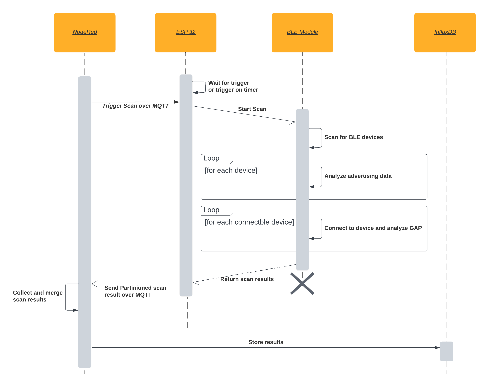

# BLE (Bluetooth Low Energy) Room occupancy detection
This section provides an introduction to the project, while the deployment process is detailed in the [Deployment](./Deployment.md) document.

## Contents
- [Introduction](#introduction)
- [Improving Herbrich's approach](#improving-herbrichs-approach)
  - [Associating a Person with a BLE Device](#associating-a-person-with-a-ble-device)
  - [Multiple BLE Scanners](#multiple-ble-scanners)
  - [Collecting the scan results](#collecting-the-scan-results)
- [Research and Ideas](#research-and-ideas)
  - [Advertising Data in Apple Devices](#advertising-data-in-apple-devices)
  - [Ideas/Imporvements](#ideasimporvements)

## Introduction
This project builds upon the work of Justin Steven Herbrich, whose project can be accessed [here](https://github.com/jutnhbr/dln-ble-scanner-for-room-utilization). Herbrich developed an innovative approach leveraging the ubiquity of BLE-capable devices. The fundamental idea is to utilize BLE technology to detect nearby devices and estimate the occupancy of a room. This project aims to enhance Herbrich's approach, making it more scalable and accurate.

Herbrich's method for estimating the number of people in a room relies on the assumption that a BLE Device, which permits connection and has a public address, represents a consumer device and so a person. While his testing yielded promising results, there are potential enhancements to consider. Nowadays, most devices employ random MAC addresses to safeguard user privacy, including a majority of Apple devices (iPhones, MacBooks, and iPads). Despite their ability to establish a BLE connection, these devices are not counted as consumer devices (individuals) because of their use of random MAC addresses.

To address this limitation, this project proposes a solution: it identifies individuals based on their device names instead of MAC addresses. Device names are not protected by privacy measures and can serve as reliable identifiers. Additionally, this project strives to enhance the scalability of the BLE Scanner by introducing support for multiple scanners. These scanners can be strategically deployed across various rooms, with their data sent to a central system. This architecture enables the scaling of the system to encompass multiple rooms and buildings.

For an overview of the system, please refer to the diagram below.


## Improving Herbrich's approach
### Associating a Person with a BLE Device
Currently, a person is associated with a BLE Device based on the following conditions:
- The peripheral is within the scanner's range.
- The peripheral allows a connection.
- The received signal strength indicator (RSSI) is above the configured threshold (default: -100).
- The peripheral has a public address, not a random one. A public address is a unique MAC address that can be used to identify a device. Random addresses are employed to safeguard user privacy. However, they present a challenge because they can change (in some cases ever so often in an hour). This means that if a device remains within the scanner's range and changes address, it will be counted as a new device. To address this issue, you can either extend the scan interval or employ an alternative method for device identification.

These adjustments enhance the clarity and accuracy of the description.
#### My approach
#### 1. Analyze the advertising data 
To classify the peripheral device accurately, I analyze its advertising data, following the [Common Data Types](https://www.bluetooth.com/specifications/assigned-numbers/) specified by the Bluetooth SIG. The key elements analyzed are:
   - Shortened Local Name (0x08)
   - Complete Local Name (0x09)
   - Appearance (0x19)

The advertised name of the peripheral plays a crucial role in determining whether it is a smartphone. It's worth noting that, in my testing, most smartphones don't advertise their names directly in the advertising data. Instead, they often include this information as a characteristic of the GAP Service, specifically under the device info service.

The appearance type is another important factor in classifying devices, particularly smartphones. The appearance type is represented as a 2-byte value that specifies the device's category. Notably, a value in the range of 0x0040 to 0x007F typically indicates a smartphone.

#### 2. Connect to the device and read the Device info service
If valuable information cannot be obtained by analyzing the advertising data, my approach involves connecting to the device and reading the Device Info Service within the GAP Service. This step is crucial for obtaining the device's name and manufacturer. The Device Info Service (UUID 0x180A) includes the following pertinent characteristics:
- Manufacturer Name String (UUID 0x2A29)
- Model Number String (UUID 0x2A24)

For example an iPhone 13 has the following values:
- Manufacturer Name String: Apple Inc.
- Model Number String: iPhone13,4

This data can subsequently serve as a means to identify a BLE Device as a smartphone. Various approaches can be employed for this purpose, with the simplest involving a comparison of the obtained strings with a list of known smartphone names.

### Multiple BLE Scanners
In the current setup, only one BLE Scanner can be active per room at a given time. Duplicates are filtered solely at the Scanner level, and no duplicate checking occurs in the database. Consequently, if multiple scanners run concurrently, duplicate entries will accumulate in the database. Furthermore, there is no provision for storing information about the specific room in which a device was detected.

#### My approach
To address these issues, I have introduced support for multiple BLE Scanners. The workflow is as follows:
1. The BLE Scanner is initiated via an MQTT message that carries a payload containing a unique scan ID. This scan ID serves to distinguish and group scan results, along with a room ID that identifies the room where the scanner is situated.
```json
{
"uuid": "f56eb9f0-aaf9-436d-b0fb-df65ecb06c7e", 
"room": "myRoom"
}
```
To ensure uniqueness, each BLE Scanner is assigned a distinct room ID and start a scan only if the room id matches it's own room id or the room id is `all`. The central pushlishes the trigger to the topic `roomUtilization/doScan` while the BLE Scanner subscribes to the topic `roomUtilization/doScan`.

2. The BLE Scanner publishes its scan results to a topic structured as `roomUtilization/scans/myRoom` represents the room ID of the scanner. The central system, in turn, subscribes to the general topic `roomUtilization/scans/+`, where the "+" serves as a wildcard that allows it to receive data from all scanner rooms. The scan results are published as a JSON object with the following structure:
```json
{
  "scanresult": 
  "[
    {'addr': '45:88:7b:10:68:b6', 'descriptor': 'Apple Inc. iPad13,4'},
    {'addr': 'd7:9f:fb:78:8d:c3', 'descriptor': 'Philips 929002376101'},
    {'addr': '5e:cc:6c:70:b1:f4', 'descriptor': 'Apple Inc. MacBookAir8,2'},
    {'addr': '6f:11:b2:e8:46:58', 'descriptor': 'Apple Inc. MacBookPro16,3'},
    {'addr': '58:4d:66:56:32:a7', 'descriptor': 'Apple Inc. Mac14,9'},
    {'addr': '4a:27:71:c6:64:29', 'descriptor': 'Apple Inc. iPhone13,2'}
  ]", 
  "uuid": "f56eb9f0-aaf9-436d-b0fb-df65ecb06c7e-myRoom", 
  "room": "myRoom", 
  "timestamp": "9/7/2023 16:04"
}
```
3. To accommodate multiple scanners, each with its unique scan results, the central system employs a waiting mechanism with a predefined timeout. During this period, it gathers incoming scan results from all scanners, considering that each scanner is identified by a distinct UUID, combining both the room and scan trigger ID. This unique identifier ensures that scans from various rooms and triggers are distinguishable.
4. Subsequently, the central system conducts a detailed analysis of the gathered scans for each unique UUID. The results of this analysis are stored in an InfluxDB database, facilitating organized data management and retrieval.

A sequence diagram of the described workflow is provided below.
 

### Collecting the scan results 
In the current implementation, there exists a critical issue related to collecting scan results. The problem arises from the fact that only the initial result of each scan is stored, while all subsequent results are discarded. This behavior is attributed to Aioble, which may return the same device multiple times if new information, such as an updated RSSI or advertising data, becomes available during subsequent scans. As a consequence, the system retains outdated information, failing to capture the most recent data.

This flaw in the current setup has significant implications, particularly when a device transitions from a non-connectable state to a connectable one. In such cases, if the device wasn't connectable during the initial scan, it might not be counted as a person, even though it becomes connectable in a subsequent scan.

## Research and Ideas

### Advertising Data in Apple Devices
Extract from this Paper: [Handoff All Your Privacy – A Review of Apple’s
Bluetooth Low Energy Continuity Protocol](https://arxiv.org/pdf/1904.10600.pdf).


"Specifically, we investigate the following flags:
– Simultaneous LE and BR/EDR to Same Device Ca-
pable Host (H)
– Simultaneous LE and BR/EDR to Same Device Ca-
pable Controller (C)
– Peripheral device is LE only (LE)
Mobile devices were observed with flags H, C, and LE
set to 1,1,0, whereas MacBooks were set to 0,0,1. Air-
Pods lacked any flags and were thereby easily identifi-
able as the only device type with no flag attributes." 
[[article](https://arxiv.org/pdf/1904.10600.pdf), P.7].

In the study, the researchers investigated the following flags related to Apple's Bluetooth Low Energy Continuity Protocol:

- Simultaneous LE and BR/EDR to Same Device Capable Host (H)
- Simultaneous LE and BR/EDR to Same Device Capable Controller (C)
- Peripheral device is LE only (LE)

Mobile devices, at that time, were observed with flags H, C, and LE set to 1, 1, 0, respectively. On the other hand, MacBooks had these flags set to 0, 0, 1. Interestingly, AirPods, the wireless earbuds developed by Apple, lacked any of these flags, making them easily distinguishable as the only device type with no flag attributes.

However, it should be noted that this information is now considered outdated and no longer accurate. All Apple devices currently seem to share the same flag configuration, which is 11010 or 0x1A. Further testing and investigation are required to confirm this new flag configuration.

Another really interesting [article](https://hexway.io/wp-content/uploads/2020/01/apple_bleee.pdf) about the BLE Advertising Data of Apple Devices (manufacturer specific data).

### Ideas/Imporvements

- Analyze more services and characteristics that can relate with smartphones: 
  - Phone Alert Status 
- Analyze advertising data more in depth 
  - Class of Device (0x0D) with the Minor Device Class with bits 2-3 set to 1 (Smartphone) and bits 4-7 set to 0 (Uncategorized).
- Make assumption about moving or standing devices based on the RSSI. For example, if the RSSI is constantly changing, the device is moving. If the RSSI is constant, the device is standing still. This could be used to filter out devices that are standing still for a long time (e.g. a printer or a TV)
- Hash the address of the peripherals (more privacy? (not persisted anyway at the moment))
- Automate the deployment process (Docker?)
